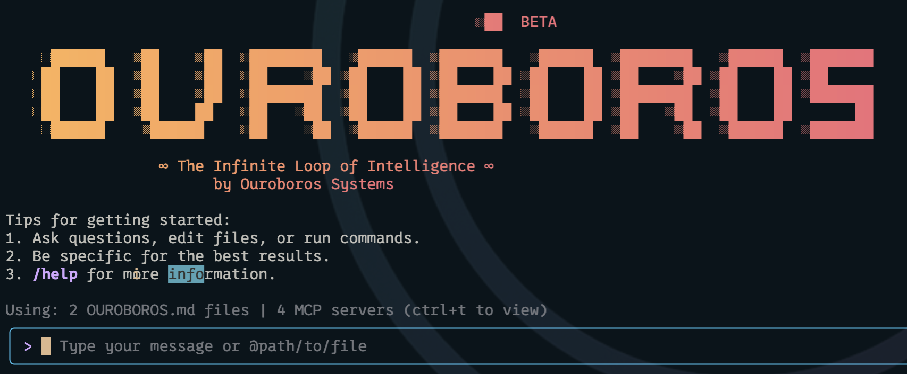

# Ouroboros Code

[](https://github.com/ouroboros-ai/ouroboros-code/actions/workflows/ci.yml)
[](https://www.npmjs.com/package/@ouroboros/ouroboros-code)
[](https://github.com/ouroboros-ai/ouroboros-code/blob/main/LICENSE)



Ouroboros Code is an advanced multi-agent AI framework that brings the power of **multiple LLM providers** (OpenAI, Anthropic, Gemini) directly into your terminal. It features **dynamic agent selection**, where GPT-5-nano intelligently chooses the best specialists for every task, transforming your terminal into a truly adaptive problem-solving environment.

## 🚀 Why Ouroboros Code?

- **🤖 Dynamic Agent Selection**: GPT-5-nano automatically chooses the best specialists (from 50+ agents) for every prompt
- **⚡ Multi-Provider Power**: Seamlessly switch between OpenAI, Anthropic, and Gemini with unified tools
- **🎯 Zero Learning Curve**: Works with any prompt - just type naturally and watch agents adapt
- **🧠 50+ Specialist Agents**: Architecture, AI/ML, Security, Performance, DevOps, Frontend, Backend experts
- **🔧 Universal Built-in Tools**: 11 tools work identically across all providers (files, web, search, shell)
- **🔌 Advanced MCP Support**: Enhanced Model Context Protocol integration with webhooks and connection pooling
- **💻 Terminal-first**: Designed for developers who live in the command line
- **🛡️ Open source**: Apache 2.0 licensed

## 📦 Installation

### Quick Install

#### Run instantly with npx

```bash
# Using npx (no installation required)
npx @ouroboros/ouroboros-code
```

#### Install globally with npm

```bash
npm install -g @ouroboros/ouroboros-code
```

#### Install globally with Homebrew (macOS/Linux)

```bash
brew install ouroboros-code
```

#### System Requirements

- Node.js version 20 or higher
- macOS, Linux, or Windows

## Release Cadence and Tags

See [Releases](./docs/releases.md) for more details.

### Preview

New preview releases will be published each week at UTC 2359 on Tuesdays. These releases will not have been fully vetted and may contain regressions or other outstanding issues. Please help us test and install with `preview` tag.

```bash
npm install -g @ouroboros/ouroboros-code@preview
```

### Stable

- New stable releases will be published each week at UTC 2000 on Tuesdays, this will be the full promotion of last week's `preview` release + any bug fixes and validations. Use `latest` tag.

```bash
npm install -g @ouroboros/ouroboros-code@latest
```

### Nightly

- New releases will be published each week at UTC 0000 each day, This will be all changes from the main branch as represented at time of release. It should be assumed there are pending validations and issues. Use `nightly` tag.

```bash
npm install -g @ouroboros/ouroboros-code@nightly
```

## 📋 Key Features

### 🤖 Dynamic Agent Selection System

The `/agents` auto mode transforms Ouroboros Code into an adaptive problem-solving environment where **GPT-5-nano automatically selects the best specialists** for every task. No more guessing which expert to call - the system analyzes your prompt and activates the perfect combination of agents.

#### How Auto Mode Works

1. **Intelligent Analysis**: GPT-5-nano analyzes your prompt to understand the task domain and complexity
2. **Expert Selection**: Chooses 1-3 most relevant specialists from 50+ available agents
3. **Automatic Activation**: Temporarily activates selected agents for that conversation turn
4. **Enhanced Response**: Your prompt gets processed with combined expert knowledge
5. **State Restoration**: Returns to your original configuration after the response

#### Key Features

- **🎯 Always the Right Expert**: Never again wonder which specialist to use - the system knows
- **⚡ 2-3 Second Overhead**: Minimal delay for maximum expertise enhancement
- **🧠 50+ Expert Agents**: Architecture, AI/ML, Security, Performance, DevOps, Frontend, Backend, and more
- **📊 Transparent Process**: See which agents were selected and why, with confidence scores
- **🔄 Smart Context**: Temporary activation per turn, automatic state restoration
- **📈 Learning System**: Tracks selection patterns and improves over time

#### Agent Categories Available

- **Architecture & Design** (5 agents): Systems Architect, API Designer, Solution Architect, Microservices Architect, Cloud Architect
- **AI/ML Specialists** (5 agents): ML Engineer, Data Scientist, Computer Vision Expert, NLP Specialist, LLM Integration Expert
- **Security & Compliance** (5 agents): Security Auditor, DevSecOps Engineer, Privacy Engineer, Compliance Specialist, Penetration Tester
- **Performance & Optimization** (5 agents): Performance Engineer, Scalability Architect, Database Optimizer, Caching Specialist, Load Testing Engineer
- **Database & Data** (5 agents): Database Architect, Data Engineer, Data Analyst, Big Data Specialist, Data Warehouse Architect
- **DevOps & Infrastructure** (5 agents): DevOps Engineer, Kubernetes Operator, Cloud Engineer, Infrastructure Architect, Site Reliability Engineer
- **Frontend Specialists** (5 agents): React Specialist, Frontend Architect, UI/UX Developer, Mobile Developer, Web Performance Specialist
- **Backend Specialists** (5 agents): Backend Architect, Node.js Specialist, Python Specialist, Java Specialist, Go Specialist
- **Specialized Domains** (5 agents): Blockchain Developer, IoT Specialist, Game Development Specialist, IoT Edge Specialist, Embedded Systems Engineer
- **Process & Quality** (5 agents): Code Quality Analyst, Test Automation Engineer, Agile Coach, Project Manager, QA Manager

#### Usage Examples

```bash
# Enable automatic agent selection
/agents on

# Every prompt now gets intelligent agent selection:
"Optimize my React component performance" 
# → GPT-5-nano selects: React Specialist + Web Performance Specialist
# → Response includes React-specific optimization techniques + performance monitoring strategies

"Design a REST API for user authentication"
# → GPT-5-nano selects: API Designer + Security Auditor + Microservices Architect  
# → Response covers API design patterns + security best practices + scalable architecture

"My database queries are slow, especially the user analytics dashboard"
# → GPT-5-nano selects: Database Optimizer + Data Analyst
# → Response includes query optimization techniques + analytics-specific indexing strategies

"Build a microservices deployment pipeline with security scanning"
# → GPT-5-nano selects: DevOps Engineer + Security Auditor + Microservices Architect
# → Response covers CI/CD best practices + security integration + service orchestration

# Monitor and understand the selection process
/agents history    # See recent automatic selections with reasoning
/agents stats      # View selection patterns and performance metrics
/agents test "prompt"  # Test what agents would be selected without executing

# Toggle when needed
/agents off        # Disable automatic selection
/agents status     # Check current mode and active agents
```

#### Advanced Features

- **Selection Confidence**: Each selection includes a confidence score (0-100%) showing system certainty
- **Multi-Agent Synergy**: Automatically selects complementary agents that work well together
- **Context Awareness**: Considers conversation history and project context for better selections
- **Fallback Systems**: Heuristic selection if AI selection fails, ensuring you always get help
- **Performance Tracking**: Monitors selection accuracy and adjusts over time
- **Command-Aware**: Automatically skips agent selection for slash commands and @ directives

### ⚡ Multi-Provider Architecture

- **Unified Tool Experience**: 11 builtin tools work identically across OpenAI, Anthropic, and Gemini
- **Seamless Provider Switching**: Zero functionality loss when changing providers
- **Provider-Specific Optimization**: Tailored configurations for each LLM's strengths
- **Advanced MCP Integration**: Enhanced Model Context Protocol with connection pooling and webhooks

### 🔧 Universal Built-in Tools

All tools work identically across every provider:
- **File Operations**: `read_file`, `write_file`, `edit_file`, `read_many_files`, `ls`, `glob`, `grep`
- **Web Operations**: `web_fetch`, `google_web_search`
- **System Operations**: `run_shell_command`, `save_memory`

### Code Understanding & Generation

- Query and edit large codebases with specialist agent expertise
- Generate new apps from PDFs, images, or sketches using multimodal capabilities
- Debug issues and troubleshoot with natural language, automatically getting the right specialist help

### Automation & Integration

- Automate operational tasks with dynamic agent selection for optimal results
- Advanced MCP servers with webhook callbacks for asynchronous tool execution
- Run non-interactively in scripts with pre-configured agent preferences

### GitHub Integration

Integrate Gemini CLI directly into your GitHub workflows with [**Gemini CLI GitHub Action**](https://github.com/google-github-actions/run-gemini-cli):

- **Pull Request Reviews**: Automated code review with contextual feedback and suggestions
- **Issue Triage**: Automated labeling and prioritization of GitHub issues based on content analysis
- **On-demand Assistance**: Mention `@gemini-cli` in issues and pull requests for help with debugging, explanations, or task delegation
- **Custom Workflows**: Build automated, scheduled and on-demand workflows tailored to your team's needs

## 🔐 Authentication Options

Choose the authentication method that best fits your needs:

### Option 1: OAuth login (Using your Google Account)

**✨ Best for:** Individual developers as well as anyone who has a Gemini Code Assist License. (see [quota limits and terms of service](https://cloud.google.com/gemini/docs/quotas) for details)

**Benefits:**

- **Free tier**: 60 requests/min and 1,000 requests/day
- **Gemini 2.5 Pro** with 1M token context window
- **No API key management** - just sign in with your Google account
- **Automatic updates** to latest models

#### Start Gemini CLI, then choose OAuth and follow the browser authentication flow when prompted

```bash
gemini
```

#### If you are using a paid Code Assist License from your organization, remember to set the Google Cloud Project

```bash
# Set your Google Cloud Project
export GOOGLE_CLOUD_PROJECT="YOUR_PROJECT_NAME"
gemini
```

### Option 2: Gemini API Key

**✨ Best for:** Developers who need specific model control or paid tier access

**Benefits:**

- **Free tier**: 100 requests/day with Gemini 2.5 Pro
- **Model selection**: Choose specific Gemini models
- **Usage-based billing**: Upgrade for higher limits when needed

```bash
# Get your key from https://aistudio.google.com/apikey
export GEMINI_API_KEY="YOUR_API_KEY"
gemini
```

### Option 3: Vertex AI

**✨ Best for:** Enterprise teams and production workloads

**Benefits:**

- **Enterprise features**: Advanced security and compliance
- **Scalable**: Higher rate limits with billing account
- **Integration**: Works with existing Google Cloud infrastructure

```bash
# Get your key from Google Cloud Console
export GOOGLE_API_KEY="YOUR_API_KEY"
export GOOGLE_GENAI_USE_VERTEXAI=true
gemini
```

For Google Workspace accounts and other authentication methods, see the [authentication guide](./docs/cli/authentication.md).

## 🚀 Getting Started

### Basic Usage

#### Start in current directory

```bash
ouroboros-code
```

#### Include multiple directories

```bash
ouroboros-code --include-directories ../lib,../docs
```

#### Use specific provider and model

```bash
ouroboros-code --provider openai -m gpt-5
ouroboros-code --provider anthropic -m claude-4
ouroboros-code --provider gemini -m gemini-2.5-flash
```

#### Non-interactive mode for scripts

```bash
ouroboros-code -p "Explain the architecture of this codebase"
```

### Quick Examples

#### Start a new project

```bash
cd new-project/
ouroboros-code
> Write me a Discord bot that answers questions using a FAQ.md file I will provide
```

#### Analyze existing code

```bash
git clone https://github.com/ouroboros-ai/ouroboros-code
cd ouroboros-code
ouroboros-code
> Give me a summary of all of the changes that went in yesterday
```

## 📚 Documentation

### Getting Started

- [**Quickstart Guide**](./docs/cli/index.md) - Get up and running quickly
- [**Authentication Setup**](./docs/cli/authentication.md) - Detailed auth configuration
- [**Configuration Guide**](./docs/cli/configuration.md) - Settings and customization
- [**Keyboard Shortcuts**](./docs/keyboard-shortcuts.md) - Productivity tips

### Core Features

- [**Commands Reference**](./docs/cli/commands.md) - All slash commands (`/help`, `/chat`, `/mcp`, etc.)
- [**Checkpointing**](./docs/checkpointing.md) - Save and resume conversations
- [**Memory Management**](./docs/tools/memory.md) - Using GEMINI.md context files
- [**Token Caching**](./docs/cli/token-caching.md) - Optimize token usage

### Tools & Extensions

- [**Built-in Tools Overview**](./docs/tools/index.md)
  - [File System Operations](./docs/tools/file-system.md)
  - [Shell Commands](./docs/tools/shell.md)
  - [Web Fetch & Search](./docs/tools/web-fetch.md)
  - [Multi-file Operations](./docs/tools/multi-file.md)
- [**MCP Server Integration**](./docs/tools/mcp-server.md) - Extend with custom tools
- [**Custom Extensions**](./docs/extension.md) - Build your own commands

### Advanced Topics

- [**Architecture Overview**](./docs/architecture.md) - How Gemini CLI works
- [**IDE Integration**](./docs/ide-integration.md) - VS Code companion
- [**Sandboxing & Security**](./docs/sandbox.md) - Safe execution environments
- [**Enterprise Deployment**](./docs/deployment.md) - Docker, system-wide config
- [**Telemetry & Monitoring**](./docs/telemetry.md) - Usage tracking
- [**Tools API Development**](./docs/core/tools-api.md) - Create custom tools

### Configuration & Customization

- [**Settings Reference**](./docs/cli/configuration.md) - All configuration options
- [**Theme Customization**](./docs/cli/themes.md) - Visual customization
- [**.gemini Directory**](./docs/gemini-ignore.md) - Project-specific settings
- [**Environment Variables**](./docs/cli/configuration.md#environment-variables)

### Troubleshooting & Support

- [**Troubleshooting Guide**](./docs/troubleshooting.md) - Common issues and solutions
- [**FAQ**](./docs/troubleshooting.md#frequently-asked-questions) - Quick answers
- Use `/bug` command to report issues directly from the CLI

### Using MCP Servers

Configure MCP servers in `~/.gemini/settings.json` to extend Gemini CLI with custom tools:

```text
> @github List my open pull requests
> @slack Send a summary of today's commits to #dev channel
> @database Run a query to find inactive users
```

See the [MCP Server Integration guide](./docs/tools/mcp-server.md) for setup instructions.

## 🤝 Contributing

We welcome contributions! Gemini CLI is fully open source (Apache 2.0), and we encourage the community to:

- Report bugs and suggest features
- Improve documentation
- Submit code improvements
- Share your MCP servers and extensions

See our [Contributing Guide](./CONTRIBUTING.md) for development setup, coding standards, and how to submit pull requests.

Check our [Official Roadmap](https://github.com/orgs/google-gemini/projects/11/) for planned features and priorities.

## 📖 Resources

- **[Official Roadmap](./ROADMAP.md)** - See what's coming next
- **[NPM Package](https://www.npmjs.com/package/@google/gemini-cli)** - Package registry
- **[GitHub Issues](https://github.com/google-gemini/gemini-cli/issues)** - Report bugs or request features
- **[Security Advisories](https://github.com/google-gemini/gemini-cli/security/advisories)** - Security updates

### Uninstall

See the [Uninstall Guide](docs/Uninstall.md) for removal instructions.

## 📄 Legal

- **License**: [Apache License 2.0](LICENSE)
- **Terms of Service**: [Terms & Privacy](./docs/tos-privacy.md)
- **Security**: [Security Policy](SECURITY.md)

---

<p align="center">
  Built with ❤️ by Google and the open source community
</p>
