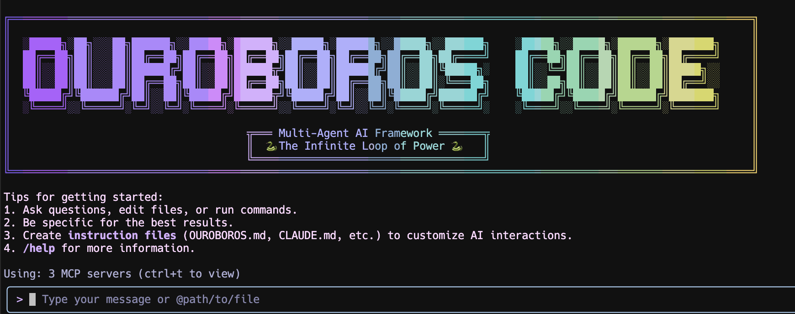

# Ouroboros Code 🐍 - Beta v1.0.0-beta.2



**Ouroboros Code** is an advanced multi-agent AI framework that brings the power of **multiple LLM providers** (Gemini, OpenAI, Anthropic) directly into your terminal. Built on the foundation of Gemini CLI, it extends the capabilities with unified tool architecture, seamless provider migration, innovative convergence analysis, and now **plug-and-play extension provider system** for local inference—all while maintaining full compatibility with Gemini's powerful features.

## 🚀 Why Ouroboros Code?

### Multi-LLM Provider Architecture
- **🔄 Provider Flexibility**: Seamlessly switch between Gemini, OpenAI (GPT-5), and Anthropic (Opus 4.1, Claude 4)
- **🔌 Extension Providers**: Install local inference providers (Ollama, vLLM, Transformers.js) as plug-and-play extensions
- **⚡ Unified Tools**: All 11 builtin tools work identically across every provider
- **🎯 Zero Migration Cost**: Switch providers without losing any functionality
- **🧬 Convergence Analysis**: Compare and synthesize responses from multiple providers
- **💻  Image inputs:** Copy paste images from your clipboard and use them as input for increased contextual understanding

### Inherited Gemini Power
- **🎯 Free tier**: 60 requests/min and 1,000 requests/day with personal Google account
- **🧠 Powerful Gemini 2.5 Pro**: Access to 1M token context window
- **🔧 Built-in tools**: Google Search grounding, file operations, shell commands, web fetching
- **🔌 Extensible**: Advanced MCP (Model Context Protocol) with connection pooling
- **💻 Terminal-first**: Designed for developers who live in the command line
- **🛡️ Open source**: Apache 2.0 licensed

## 📦 Installation

### Quick Install

#### Run instantly with npx

```bash
# Using npx (no installation required)
npx https://github.com/google-gemini/gemini-cli  # Still works!
```

#### Install globally with npm

```bash
npm install -g @google/gemini-cli  # Includes Ouroboros features
```

#### Install globally with Homebrew (macOS/Linux)

```bash
brew install gemini-cli  # Enhanced with Ouroboros
```

#### System Requirements

- Node.js version 20 or higher
- macOS, Linux, or Windows

## Release Cadence and Tags

See [Releases](./docs/releases.md) for more details.

### Preview

New preview releases will be published each week at UTC 2359 on Tuesdays. These releases will not have been fully vetted and may contain regressions or other outstanding issues. Please help us test and install with `preview` tag.

```bash
npm install -g @google/gemini-cli@preview
```

### Stable

- New stable releases will be published each week at UTC 2000 on Tuesdays, this will be the full promotion of last week's `preview` release + any bug fixes and validations. Use `latest` tag.

```bash
npm install -g @google/gemini-cli@latest
```

### Nightly

- New releases will be published each week at UTC 0000 each day, This will be all changes from the main branch as represented at time of release. It should be assumed there are pending validations and issues. Use `nightly` tag.

```bash
npm install -g @google/gemini-cli@nightly
```

## 🐍 Ouroboros-Specific Features

### Advanced Multi-Provider Commands

- **`/compare`** - Get parallel solutions from multiple providers for comprehensive analysis
- **`/converge`** - Synthesize responses from all providers into unified insights
- **`/challenge`** - Create adversarial dialogues between providers for critical analysis
- **`/blindspot`** - Identify what each provider might be missing in their responses
- **`/race`** - Performance-optimized provider racing for fastest responses

### 🧪 Experimental Agent-to-Agent (A2A) Communication

- **`--experimental-a2a-mode`** - Enable Agent-to-Agent communication via webhooks (port 45123)
- **Targeted Messaging** - Send messages to specific agent processes using PID-based filtering
- **Broadcast Communication** - Send messages to all listening agents simultaneously
- **Multi-Agent Coordination** - Enable sophisticated agent collaboration workflows

```bash
# Enable A2A communication in interactive mode
ouroboros-code --experimental-a2a-mode

# Use A2A with debug output to see message routing
ouroboros-code --experimental-a2a-mode --debug
```

### 🔌 Extension Provider System (Beta)

Install and use local inference providers through our plug-and-play extension system:

```bash
# Install provider extensions
ouroboros-code extension install extensions/ollama-provider/
ouroboros-code extension install extensions/vllm-provider/
ouroboros-code extension install extensions/transformersjs-provider/

# Use installed providers immediately
ouroboros-code --provider ollama "Run this locally with Ollama"
ouroboros-code --provider vllm "High-performance inference with vLLM"
ouroboros-code --provider transformersjs "Client-side AI with WebAssembly"

# Manage extensions
ouroboros-code extension list                       # List installed extensions
ouroboros-code extension uninstall ollama-provider  # Remove extension
```

📚 **[Full Extension Provider Documentation](docs/EXTENSION_PROVIDERS.md)** - Learn how to use and create provider extensions

### Unified Tool Architecture

All 11 builtin tools work identically across every provider:
- **File Operations**: `read_file`, `write_file`, `edit_file`, `read_many_files`
- **Search & Discovery**: `ls`, `glob`, `grep`
- **Web Operations**: `web_fetch`, `google_web_search`
- **System Operations**: `run_shell_command`, `save_memory`

### Smart Instruction Files

Seamlessly migrate from the agent of your choice to Ouroboros-code:
1. **OUROBOROS.md** - Primary configuration (highest priority)
2. **CLAUDE.md** - Claude Code support
3. **GEMINI.md** - Gemini cli support
4. **AGENTS.md** - OpenAI Codex cli support
5. **QWEN.md** - Qwen-Code cli support
6. **CRUSH.md** - Crush cli support

## 📋 Core Features (Inherited from Gemini CLI)

### Code Understanding & Generation

- Query and edit large codebases
- Generate new apps from PDFs, images, or sketches using multimodal capabilities
- Debug issues and troubleshoot with natural language

### Automation & Integration

- Automate operational tasks like querying pull requests or handling complex rebases
- Use MCP servers to connect new capabilities, including [media generation with Imagen, Veo or Lyria](https://github.com/GoogleCloudPlatform/vertex-ai-creative-studio/tree/main/experiments/mcp-genmedia)
- Run non-interactively in scripts for workflow automation

### Advanced Capabilities

- Ground your queries with built-in [Google Search](https://ai.google.dev/gemini-api/docs/grounding) for real-time information
- Conversation checkpointing to save and resume complex sessions
- Multi-file instruction system (OUROBOROS.md, CLAUDE.md, GEMINI.md, etc.) with priority loading

### GitHub Integration

Integrate Gemini CLI directly into your GitHub workflows with [**Gemini CLI GitHub Action**](https://github.com/google-github-actions/run-gemini-cli):

- **Pull Request Reviews**: Automated code review with contextual feedback and suggestions
- **Issue Triage**: Automated labeling and prioritization of GitHub issues based on content analysis
- **On-demand Assistance**: Mention `@gemini-cli` in issues and pull requests for help with debugging, explanations, or task delegation
- **Custom Workflows**: Build automated, scheduled and on-demand workflows tailored to your team's needs

## 🔐 Authentication Options

Choose the authentication method that best fits your needs:

### Option 1: OAuth login (Using your Google Account)

**✨ Best for:** Individual developers as well as anyone who has a Gemini Code Assist License. (see [quota limits and terms of service](https://cloud.google.com/gemini/docs/quotas) for details)

**Benefits:**

- **Free tier**: 60 requests/min and 1,000 requests/day
- **Gemini 2.5 Pro** with 1M token context window
- **No API key management** - just sign in with your Google account
- **Automatic updates** to latest models

#### Start Ouroboros Code, then choose OAuth and follow the browser authentication flow when prompted

```bash
ouroboros-code  # Primary command
# or
gemini          # Still works for compatibility
```

#### If you are using a paid Code Assist License from your organization, remember to set the Google Cloud Project

```bash
# Set your Google Cloud Project
export GOOGLE_CLOUD_PROJECT="YOUR_PROJECT_NAME"
gemini
```

### Option 2: API Keys (Gemini, OpenAI, Anthropic)

**✨ Best for:** Developers who need specific model control or paid tier access

**Benefits:**

- **Free tier**: 100 requests/day with Gemini 2.5 Pro
- **Model selection**: Choose specific Gemini models
- **Usage-based billing**: Upgrade for higher limits when needed

```bash
# Gemini (default provider)
export GEMINI_API_KEY="YOUR_API_KEY"  # From https://aistudio.google.com/apikey

# OpenAI GPT-5
export OPENAI_API_KEY="YOUR_API_KEY"  # From https://platform.openai.com/api-keys

# Anthropic Claude 4
export ANTHROPIC_API_KEY="YOUR_API_KEY"  # From https://console.anthropic.com/

ouroboros-code --provider gemini  # or openai, anthropic
```

### Option 3: Claude OAuth (Claude Max Subscribers)

**✨ Best for:** Claude Max subscribers who want seamless authentication without API keys

**Benefits:**

- **🔐 No API key management** - OAuth 2.0 authentication with PKCE security
- **🌐 Browser integration** - User-friendly authentication flow with HTML feedback
- **🔄 Automatic token refresh** - Seamless session management with exponential backoff
- **📱 Cross-platform compatibility** - Import tokens from Python SDK and Claude CLI
- **🛡️ Secure storage** - RFC 7636 compliant with encrypted token storage

#### Authenticate with Claude OAuth

```bash
# First-time authentication (opens browser)
ouroboros-code auth claude login

# Headless authentication (get URL to visit manually)
ouroboros-code auth claude login --no-browser

# Check authentication status
ouroboros-code auth claude status --verbose

# Use Claude with OAuth
ouroboros-code --provider anthropic --claude-use-oauth
```

#### Import existing credentials

```bash
# List available credential sources
ouroboros-code auth claude import --list-sources

# Import from Python SDK
ouroboros-code auth claude import --from ~/.claude_code/tokens.json

# Auto-import from detected locations
ouroboros-code auth claude import
```

#### Manage authentication

```bash
# Logout (revoke tokens on server and clear locally)
ouroboros-code auth claude logout

# Clear only local tokens (keep server tokens active)
ouroboros-code auth claude logout --local-only
```

### Option 4: Vertex AI

**✨ Best for:** Enterprise teams and production workloads

**Benefits:**

- **Enterprise features**: Advanced security and compliance
- **Scalable**: Higher rate limits with billing account
- **Integration**: Works with existing Google Cloud infrastructure

```bash
# Get your key from Google Cloud Console
export GOOGLE_API_KEY="YOUR_API_KEY"
export GOOGLE_GENAI_USE_VERTEXAI=true
gemini
```

For Google Workspace accounts and other authentication methods, see the [authentication guide](./docs/cli/authentication.md).

### Option 5: Local Inference Providers (Extensions)

**🔥 New in Beta!** Ouroboros Code now supports local inference through installable extensions, giving you complete privacy and control over your AI workflows.

**✨ Benefits:**
- **🏠 Complete Privacy**: Run models locally without sending data to external APIs
- **💰 Cost-Free**: No API usage fees after initial setup
- **📶 Offline Capable**: Work without internet connection
- **🎛️ Full Control**: Choose models, parameters, and infrastructure
- **🔧 Customizable**: Install only the providers you need

#### Available Local Provider Extensions

##### 🦙 Ollama Provider
High-quality local LLM inference with model management

```bash
# Install Ollama extension
ouroboros-code extension install ollama-provider

# Check provider details
ouroboros-code --provider-info ollama

# Use Ollama
ouroboros-code --provider ollama "Explain quantum computing"
ouroboros-code --provider ollama --model llama3.1:8b "Write Python code"
```

##### 🚀 vLLM Provider
High-performance inference server optimized for throughput

```bash
# Install vLLM extension  
ouroboros-code extension install vllm-provider

# Use vLLM with GPU acceleration
ouroboros-code --provider vllm --model meta-llama/Llama-3.1-8B-Instruct "Hello"
```

##### 🌐 Transformers.js Provider
Browser-compatible JavaScript inference with Web Workers

```bash
# Install Transformers.js extension
ouroboros-code extension install transformers-provider

# Use lightweight models
ouroboros-code --provider transformers --model Xenova/gpt2 "Generate text"
```

#### Extension Management

```bash
# List installed extensions
ouroboros-code extension list

# Get detailed provider information
ouroboros-code --provider-info ollama
ouroboros-code --provider-info vllm
ouroboros-code --provider-info transformers

# Remove extensions
ouroboros-code extension remove ollama-provider
```

**📋 Requirements**: Each extension has specific requirements (GPU, memory, dependencies) that are validated during installation.

## 🚀 Getting Started

### Basic Usage

#### Start in current directory

```bash
ouroboros-code  # Uses default provider (Gemini)
```

#### Use different providers

```bash
ouroboros-code --provider openai    # Use GPT-5
ouroboros-code --provider anthropic # Use Claude 4
ouroboros-code --provider gemini    # Use Gemini (default)
```

#### Include multiple directories

```bash
ouroboros-code --include-directories ../lib,../docs
```

#### Use specific model

```bash
ouroboros-code -m gemini-2.5-flash        # Gemini model
ouroboros-code -m gpt-5 --provider openai # OpenAI model
ouroboros-code -m claude-4-opus --provider anthropic # Anthropic model
```

#### Non-interactive mode for scripts

```bash
ouroboros-code -p "Explain the architecture of this codebase"
```

### Quick Examples

#### Start a new project with provider comparison

```bash
cd new-project/
ouroboros-code
> /compare Write me a Discord bot that answers questions using a FAQ.md file
# Compares solutions from multiple providers side-by-side
```

#### Analyze existing code with convergence

```bash
git clone https://github.com/google-gemini/gemini-cli
cd gemini-cli
ouroboros-code
> /converge Analyze this codebase architecture and suggest improvements
# Synthesizes insights from all providers into unified recommendations
```

## 📚 Documentation

### Getting Started

- [**Quickstart Guide**](./docs/cli/index.md) - Get up and running quickly
- [**Authentication Setup**](./docs/cli/authentication.md) - Detailed auth configuration
- [**Configuration Guide**](./docs/cli/configuration.md) - Settings and customization
- [**Keyboard Shortcuts**](./docs/keyboard-shortcuts.md) - Productivity tips

### Core Features

- [**Commands Reference**](./docs/cli/commands.md) - All slash commands (`/help`, `/chat`, `/mcp`, etc.)
- [**Checkpointing**](./docs/checkpointing.md) - Save and resume conversations
- [**Memory Management**](./docs/tools/memory.md) - Multi-file instruction system (OUROBOROS.md, CLAUDE.md, etc.)
- [**Token Caching**](./docs/cli/token-caching.md) - Optimize token usage

### Tools & Extensions

- [**Built-in Tools Overview**](./docs/tools/index.md)
  - [File System Operations](./docs/tools/file-system.md)
  - [Shell Commands](./docs/tools/shell.md)
  - [Web Fetch & Search](./docs/tools/web-fetch.md)
  - [Multi-file Operations](./docs/tools/multi-file.md)
- [**MCP Server Integration**](./docs/tools/mcp-server.md) - Extend with custom tools
- [**Custom Extensions**](./docs/extension.md) - Build your own commands

### Advanced Topics

- [**Architecture Overview**](./docs/architecture.md) - How Gemini CLI works
- [**IDE Integration**](./docs/ide-integration.md) - VS Code companion
- [**Sandboxing & Security**](./docs/sandbox.md) - Safe execution environments
- [**Enterprise Deployment**](./docs/deployment.md) - Docker, system-wide config
- [**Telemetry & Monitoring**](./docs/telemetry.md) - Usage tracking
- [**Tools API Development**](./docs/core/tools-api.md) - Create custom tools

### Configuration & Customization

- [**Settings Reference**](./docs/cli/configuration.md) - All configuration options
- [**Theme Customization**](./docs/cli/themes.md) - Visual customization
- [**.gemini Directory**](./docs/gemini-ignore.md) - Project-specific settings
- [**Environment Variables**](./docs/cli/configuration.md#environment-variables)

### Troubleshooting & Support

- [**Troubleshooting Guide**](./docs/troubleshooting.md) - Common issues and solutions
- [**FAQ**](./docs/troubleshooting.md#frequently-asked-questions) - Quick answers
- Use `/bug` command to report issues directly from the CLI

### Using MCP Servers

Configure MCP servers in `~/.gemini/settings.json` to extend Gemini CLI with custom tools:

```text
> @github List my open pull requests
> @slack Send a summary of today's commits to #dev channel
> @database Run a query to find inactive users
```

See the [MCP Server Integration guide](./docs/tools/mcp-server.md) for setup instructions.

## 🤝 Contributing

We welcome contributions! Gemini CLI is fully open source (Apache 2.0), and we encourage the community to:

- Report bugs and suggest features
- Improve documentation
- Submit code improvements
- Share your MCP servers and extensions

See our [Contributing Guide](./CONTRIBUTING.md) for development setup, coding standards, and how to submit pull requests.

Check our [Official Roadmap](https://github.com/orgs/google-gemini/projects/11/) for planned features and priorities.

## 📖 Resources

- **[Official Roadmap](./ROADMAP.md)** - See what's coming next
- **[NPM Package](https://www.npmjs.com/package/@google/gemini-cli)** - Package registry
- **[GitHub Issues](https://github.com/google-gemini/gemini-cli/issues)** - Report bugs or request features
- **[Security Advisories](https://github.com/google-gemini/gemini-cli/security/advisories)** - Security updates

### Uninstall

See the [Uninstall Guide](docs/Uninstall.md) for removal instructions.

## 📄 Legal

- **License**: [Apache License 2.0](LICENSE)
- **Terms of Service**: [Terms & Privacy](./docs/tos-privacy.md)
- **Security**: [Security Policy](SECURITY.md)

---

<p align="center">
  Built with ❤️ by Google and the open source community
</p>
