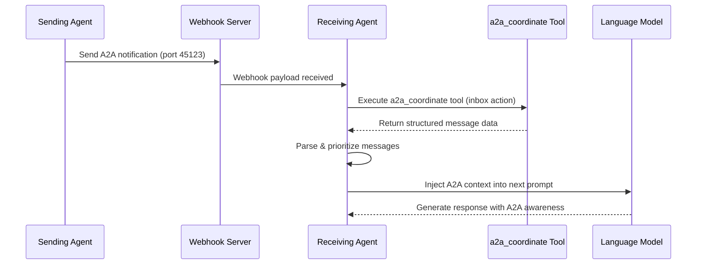

# Autonomous Agent-to-Agent (A2A) Communication Architecture

## Overview

The Autonomous Agent-to-Agent (A2A) Communication System enables ouroboros-code instances operating in autonomous mode to seamlessly communicate with each other through webhook notifications and MCP tool execution. This system provides real-time message processing, priority-based handling, and automatic context injection into LLM conversations.

## Architecture Components

### 1. AutonomousA2AHandler

**Location**: `packages/core/src/agents/AutonomousA2AHandler.ts`

The core component responsible for:
- Webhook notification listening on port 45123
- Automatic execution of `a2a_coordinate` MCP tool
- Message parsing and priority handling
- Agent context management
- Background processing during autonomous mode

#### Key Features:
- **Webhook Integration**: Listens for A2A notifications via HTTP webhook server
- **MCP Tool Execution**: Auto-executes `a2a_coordinate` tool with `inbox` action
- **Priority Processing**: Handles urgent, high, medium, and low priority messages
- **Context Management**: Maintains agent conversation state and capabilities

### 2. A2AContextInjector

**Location**: `packages/core/src/core/A2AContextInjector.ts`

A ContentGenerator decorator that:
- Intercepts LLM generation requests in autonomous mode
- Injects pending A2A messages into prompt context
- Formats messages with priority indicators and metadata
- Maintains conversation continuity across agent interactions

#### Features:
- **Automatic Context Injection**: Seamlessly adds A2A messages to LLM prompts
- **Priority-Based Formatting**: Highlights urgent messages for immediate attention
- **Metadata Preservation**: Includes sender, timestamp, and context data
- **Clean Message Clearing**: Removes processed messages from pending queue

### 3. Integration Points

#### NonInteractive CLI Integration
**Location**: `packages/cli/src/nonInteractiveCli.ts`

- Detects autonomous mode via existing `--prompt` flag
- Initializes A2A handler automatically during autonomous operation
- Provides proper lifecycle management (start/stop)
- Maintains compatibility with existing GeminiClient approach

#### Configuration Integration
**Location**: `packages/core/src/config/config.ts`

- Added `getMCPClientManager()` method for A2A operations
- Seamless integration with existing MCP infrastructure
- Automatic tool registry and workspace context access

## Message Flow Architecture



## MCP Tool Integration

The A2A system supports **dual MCP tool integration** with automatic detection and fallback:

1. **`a2a_coordinate`** (Primary) - Advanced coordination tool with session management
2. **`mao_inbox_poll`** (Fallback) - Polling-based tool for agents without webhook support

The system automatically detects which tool is available and uses the appropriate one.

### Tool Specification: `a2a_coordinate` (Primary)

#### Required Parameters:
```json
{
  "action": "inbox",
  "sessionId": "agent-session-id",
  "limit": 50,
  "unreadOnly": true,
  "sortBy": "receivedAt",
  "sortOrder": "desc"
}
```

#### Optional Parameters:
- `since`: ISO timestamp for filtering messages
- `topic`: Filter by specific topic
- `from`: Filter by sender agent ID

#### Expected Response Format:
```json
{
  "success": true,
  "data": {
    "sessionId": "agent-session-id",
    "messages": [
      {
        "id": "msg-12345-67890-abc123",
        "from": "agent-alpha",
        "to": ["agent-beta"],
        "payload": {
          "content": "Your assistance is needed with task X",
          "task_id": "task_456"
        },
        "topic": "coordination.task-request",
        "receivedAt": "2024-01-20T10:30:00Z",
        "unread": true,
        "priority": "urgent",
        "messageType": "direct",
        "status": "delivered",
        "attachments": [],
        "metadata": {
          "requires_response": true
        }
      }
    ],
    "total": 1,
    "unreadCount": 1,
    "hasMore": false
  }
}
```

### Tool Specification: `mao_inbox_poll` (Fallback)

#### Required Parameters:
```json
{
  "agentId": "agent-001",
  "unreadOnly": true,
  "limit": 50,
  "includeExpired": false
}
```

#### Optional Parameters:
- `type`: Message type filter (`'leadership'`, `'coordinator'`, `'fitness'`, `'consensus'`, `'stigmergic'`, `'phase'`, `'general'`)
- `priority`: Priority filter (`'critical'`, `'high'`, `'normal'`, `'low'`)
- `from`: Filter by sender agent ID
- `since`: ISO timestamp for filtering messages

#### Expected Response Format:
```json
{
  "success": true,
  "data": {
    "messages": [
      {
        "id": "msg-001",
        "from": "agent-alpha",
        "to": "agent-beta",
        "type": "leadership",
        "priority": "critical",
        "content": {
          "message": "Critical coordination required",
          "task_id": "task_456"
        },
        "metadata": {
          "phase": "planning",
          "requestId": "req-123",
          "correlationId": "corr-456"
        },
        "timestamp": "2024-01-20T10:30:00Z",
        "expiresAt": "2024-01-20T18:30:00Z",
        "status": "pending",
        "attempts": 1
      }
    ],
    "count": 1,
    "stats": {
      "critical": 1,
      "leadership": 1,
      "oldest": "2024-01-20T10:30:00Z",
      "newest": "2024-01-20T10:30:00Z"
    },
    "notice": "Critical leadership messages require immediate attention"
  }
}
```

### Tool Selection Logic

The A2A handler automatically detects and selects tools in this order:

1. **Check for `a2a_coordinate`** (preferred for advanced features)
2. **Fallback to `mao_inbox_poll`** (for polling-based agents)
3. **Error if neither available**

```typescript
// Tool detection pseudocode
if (toolRegistry.getTool('a2a_coordinate')) {
  return executeA2ACoordinateTool();
} else if (toolRegistry.getTool('mao_inbox_poll')) {
  return executeMaoInboxPollTool();
} else {
  throw new Error('No A2A MCP tools available');
}
```

## Webhook Payload Specification

### A2A Notification Payload:
```json
{
  "notification_type": "a2a_message",
  "agent_data": {
    "sender_agent_id": "agent-alpha",
    "receiver_agent_id": "agent-beta", 
    "message_count": 3,
    "priority": "urgent",
    "auto_execute": true
  },
  "mcp_tool_config": {
    "tool_name": "a2a_coordinate",  // or "mao_inbox_poll"
    "auto_params": {
      // For a2a_coordinate
      "action": "inbox",
      "sessionId": "agent-beta-session",
      "unreadOnly": true,
      "limit": 50,
      
      // For mao_inbox_poll (alternative)
      "agentId": "agent-beta",
      "type": "leadership",
      "priority": "critical"
    }
  }
}
```

## Message Priority System

### Priority Levels:
1. **Critical/Urgent**: Immediate attention required, automatically flagged for response
2. **High**: Important messages that should be processed soon
3. **Normal/Medium**: Standard messages processed in order
4. **Low**: Background information, lowest processing priority

### Priority Handling:
- **Urgent messages** are highlighted with ⚠️ indicators in context
- **Response requirements** are automatically determined based on priority and message type
- **Direct messages** with high/urgent priority are flagged for response
- **Broadcast messages** typically don't require individual responses

## Agent Context Management

### AgentContext Interface:
```typescript
interface AgentContext {
  agentId: string;              // Unique agent identifier
  sessionId: string;            // Session ID for a2a_coordinate tool
  capabilities: string[];       // Agent capabilities (mcp-tools, webhook-listener, etc.)
  priority: string;             // Agent's own priority level
  operating_mode: string;       // 'autonomous' | 'interactive'
  pending_messages: AgentMessage[]; // Unprocessed A2A messages
  active_conversations: Map;    // Ongoing conversations by sender
  last_message_timestamp: string; // Last message processing time
}
```

### Context Injection Format:
```markdown
## 🤖 Agent-to-Agent Messages

You have received 2 message(s) from other agents:

### ⚠️ URGENT MESSAGES (1)

**Message 1** (from agent-alpha):
- **Priority:** URGENT
- **Timestamp:** 2024-01-20T10:30:00Z
- **Content:** Your assistance is needed with task X
- **Message Type:** leadership
- **Status:** pending
- **Context Data:** {"attempts":1,"expiresAt":"2024-01-20T18:30:00Z","metadata":{"requestId":"req-123"}}
- **⚠️ REQUIRES RESPONSE**

### 📨 Regular Messages (1)

**Message 2** (from agent-gamma):
- **Priority:** MEDIUM
- **Timestamp:** 2024-01-20T10:25:00Z
- **Content:** Status update: Task Y completed successfully
- **Message Type:** coordinator
- **Status:** delivered
- **Context Data:** {"attempts":1,"metadata":{"phase":"completion"}}

**Instructions for A2A Message Processing:**
- Review all messages above and incorporate relevant information into your response
- If any message requires immediate action or response, prioritize it
- **URGENT**: 1 message(s) require immediate attention
```

## Configuration Requirements

### 1. MCP Server Configuration
Either the `a2a_coordinate` or `mao_inbox_poll` tool must be available in the MCP server registry:

#### Option A: a2a_coordinate Server (Preferred)
```json
{
  "mcpServers": {
    "a2a_coordination": {
      "command": "a2a-coordinate-server",
      "args": ["--session-id", "current-agent-session"]
    }
  }
}
```

#### Option B: mao_inbox_poll Server (Fallback)
```json
{
  "mcpServers": {
    "mao_coordination": {
      "command": "mao-inbox-server",
      "args": ["--agent-id", "current-agent-id"]
    }
  }
}
```

#### Option C: Both Servers (Recommended)
```json
{
  "mcpServers": {
    "a2a_coordination": {
      "command": "a2a-coordinate-server",
      "args": ["--session-id", "current-agent-session"]
    },
    "mao_coordination": {
      "command": "mao-inbox-server",
      "args": ["--agent-id", "current-agent-id"]
    }
  }
}
```

### 2. Webhook Server Configuration
Webhook server automatically uses port 45123 (fixed, not random):

```typescript
// Webhook server configuration in packages/core/src/webhooks/webhook-server.ts
port: config.port || 45123
```

### 3. Autonomous Mode Detection
Uses existing `--prompt` flag to detect autonomous operation:

```bash
# Autonomous mode automatically enables A2A communication
ouroboros-code --prompt "Continue working on the project autonomously"
```

## Security Considerations

### 1. Webhook Authentication
- Webhook payloads should include authentication tokens
- Only authorized agents can send A2A notifications
- Rate limiting prevents spam and abuse

### 2. MCP Tool Security
- The `a2a_coordinate` tool should validate session ownership
- Messages are filtered by recipient agent ID
- Sensitive information is handled according to tool security policies

### 3. Context Injection Safety
- Message content is sanitized before injection
- Metadata is validated to prevent injection attacks
- Priority escalation is controlled and audited

## Deployment and Testing

### 1. Testing the A2A System

#### Manual Testing:
1. Start ouroboros-code in autonomous mode: `ouroboros-code --prompt "autonomous task"`
2. Send webhook notification to port 45123
3. Verify message appears in next LLM interaction
4. Check logs for A2A processing events

#### Integration Testing:
- Test with multiple agent instances
- Verify priority-based message handling
- Confirm proper context injection and cleanup

### 2. Monitoring and Debugging

#### Debug Logging:
Enable debug mode to see A2A processing events:
```bash
ouroboros-code --debug --prompt "autonomous task"
```

#### Log Examples:
```
[A2A] Autonomous agent mode initialized with A2A support
[A2A] Webhook notification received: a2a_message
[A2A] Executing a2a_coordinate tool for A2A inbox
[A2A] Parsed A2A coordinate response: 3 messages, 2 unread
[A2A Context] Injected 2 messages into prompt context
[A2A] Autonomous A2A handler stopped
```

## Future Enhancements

### 1. Advanced Content Generation
Replace legacy GeminiClient with A2A-aware ContentGenerator:
```typescript
// TODO: Future enhancement
const wrappedContentGenerator = new A2AContextInjector(
  baseContentGenerator,
  config,
  a2aHandler,
);
```

### 2. Direct MCP Client Manager Access
Enhanced performance through direct MCP operations:
```typescript
// TODO: Future enhancement - use _mcpClientManager for direct MCP operations
```

### 3. Enhanced Agent Coordination
- Agent discovery and registration
- Topic-based message routing
- Agent capability negotiation
- Distributed task coordination

## Troubleshooting

### Common Issues:

1. **A2A Handler Not Starting**
   - Verify autonomous mode is detected (`--prompt` flag present)
   - Check webhook server port availability (45123)
   - Ensure MCP client manager initialization

2. **Messages Not Appearing in Context**
   - Verify `a2a_coordinate` tool is available and functional
   - Check webhook payload format matches specification
   - Ensure sessionId matches agent context

3. **Tool Execution Failures**
   - Verify MCP server connection and tool registration
   - Check tool parameters match expected schema
   - Review tool response format for parsing errors

### Debug Commands:
```bash
# Test webhook endpoint
curl -X POST http://localhost:45123/webhook \
  -H "Content-Type: application/json" \
  -d '{"notification_type":"a2a_message","agent_data":{"auto_execute":true}}'

# Check MCP tool availability
ouroboros-code "List available MCP tools" --debug

# Monitor A2A processing
ouroboros-code --debug --prompt "Monitor A2A messages"
```

## Summary

The Autonomous A2A Communication System provides a robust foundation for inter-agent communication in the ouroboros-code ecosystem. By leveraging webhooks, MCP tools, and intelligent context injection, agents can seamlessly coordinate, share information, and collaborate on complex tasks while maintaining autonomous operation.

The architecture is designed for extensibility, allowing future enhancements in agent coordination, advanced routing, and distributed task management while maintaining backward compatibility and operational stability.