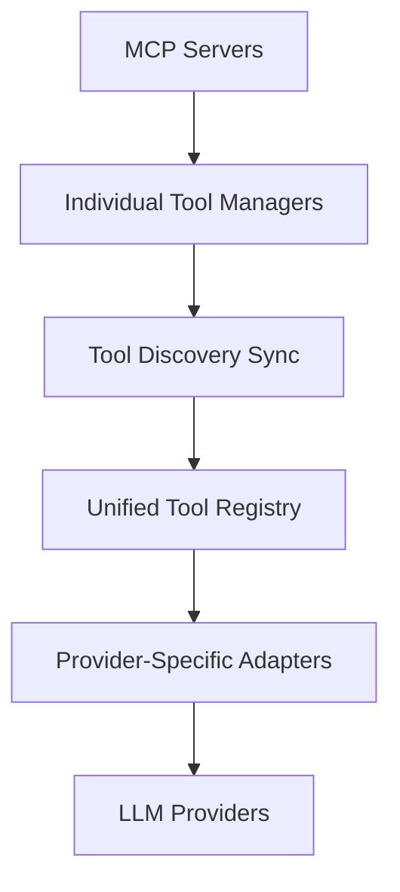
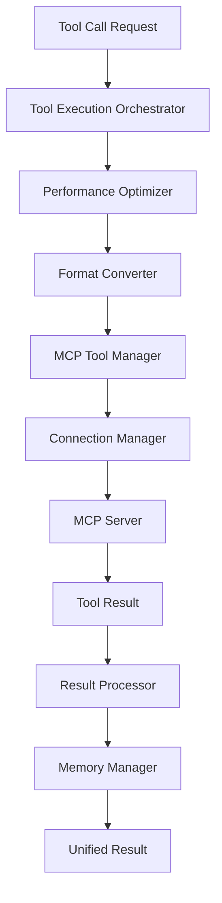

# System Overview

## Architecture Overview

The MCP Tools Integration System provides a unified framework for executing Model Context Protocol (MCP) tools across multiple LLM providers (OpenAI, Anthropic, and Gemini) with enterprise-grade reliability, performance, and monitoring.

## Core Design Principles

### 1. **Provider Abstraction**

- Unified tool interface abstracts provider-specific implementations
- Consistent API surface regardless of underlying provider
- Format conversion handled transparently

### 2. **Performance First**

- Intelligent caching reduces conversion overhead
- Connection pooling and reuse optimization
- Adaptive parallel execution with provider-specific limits
- Memory pressure monitoring and cleanup

### 3. **Reliability & Resilience**

- Automatic connection recovery with exponential backoff
- Comprehensive timeout management
- Graceful error handling and retry logic
- Health monitoring and circuit breaking

### 4. **Consistency Across Providers**

- Centralized tool registry ensures all providers see same tools
- Conflict resolution for tool version mismatches
- Synchronized tool discovery across all providers

## System Components

### Core Components

#### Unified Tool Interface (`packages/core/src/providers/tools/unified-tool-interface.ts`)

```typescript
export interface UnifiedTool {
  name: string;
  description: string;
  parameters: UnifiedToolParameters;
  metadata?: {
    version?: string;
    provider?: string;
    tags?: string[];
    dependencies?: string[];
  };
}

export abstract class ToolFormatConverter {
  abstract convertToProviderFormat<T = any>(tool: UnifiedTool): T;
  abstract convertFromProviderFormat<T = any>(tool: T): UnifiedTool;
  abstract convertCallToProviderFormat<T = any>(call: UnifiedToolCall): T;
  abstract convertResultFromProviderFormat<T = any>(
    result: T,
  ): UnifiedToolResult;
}
```

**Purpose**: Provides type-safe abstraction layer for tool definitions and format conversion across all providers.

#### Tool Adapters

- **OpenAI Adapter** (`packages/core/src/providers/openai/tool-adapter.ts`)
- **Anthropic Adapter** (`packages/core/src/providers/anthropic/tool-adapter.ts`)

```typescript
export class OpenAIToolAdapter extends ToolFormatConverter {
  convertToProviderFormat(tool: UnifiedTool): OpenAI.ChatCompletionTool {
    return {
      type: 'function',
      function: {
        name: tool.name,
        description: tool.description,
        parameters: this.convertParameterSchema(tool.parameters),
      },
    };
  }
}
```

**Purpose**: Handle provider-specific format conversion with optimized caching and validation.

#### MCP Tool Manager (`packages/core/src/providers/tools/mcp-tool-manager.ts`)

```typescript
export class MCPToolManager extends EventEmitter {
  async discoverTools(): Promise<UnifiedTool[]>;
  async executeTool(
    call: UnifiedToolCall,
    options?: ToolExecutionOptions,
  ): Promise<UnifiedToolResult>;
  async executeMultipleTools(
    calls: UnifiedToolCall[],
    options?: BatchExecutionOptions,
  ): Promise<UnifiedToolResult[]>;
}
```

**Purpose**: Central orchestrator for MCP tool discovery and execution with advanced performance optimization.

### Infrastructure Components

#### Connection Management (`packages/core/src/providers/tools/mcp-connection-manager.ts`)

```typescript
export class MCPConnectionPool extends EventEmitter {
  async getConnection(
    serverName: string,
    config: MCPConnectionConfig,
  ): Promise<MCPManagedConnection>;
  async performHealthChecks(): Promise<Record<string, boolean>>;
  async gracefulShutdown(): Promise<void>;
}

export class MCPManagedConnection extends EventEmitter {
  async connect(): Promise<void>;
  async executeRequest<T>(method: string, params?: any): Promise<T>;
  async performHealthCheck(): Promise<boolean>;
}
```

**Features**:

- Automatic reconnection with exponential backoff
- Connection pooling and reuse optimization
- Health monitoring and circuit breaking
- Graceful shutdown procedures

#### Performance Optimization (`packages/core/src/providers/tools/performance-optimizer.ts`)

```typescript
export class PerformanceOptimizer extends EventEmitter {
  optimizeConversion<T>(
    tool: UnifiedTool,
    converter: ToolFormatConverter,
    providerId: string,
  ): OptimizationResult<T>;
  optimizeParallelExecution(
    toolCalls: UnifiedToolCall[],
    providerId: string,
  ): ParallelExecutionPlan;
  optimizeConnection(providerId: string): ConnectionOptimization;
}
```

**Features**:

- Format conversion caching (90%+ hit rate)
- Adaptive parallel execution (2-10 concurrent operations)
- Connection reuse scoring and optimization
- Real-time performance metrics

#### Memory Management (`packages/core/src/providers/tools/memory-manager.ts`)

```typescript
export class MemoryManager extends EventEmitter {
  createExecutionContext(
    toolCallId: string,
    toolName: string,
    providerId: string,
  ): ToolExecutionMemoryContext;
  registerObject(
    toolCallId: string,
    object: any,
    cleanupCallback?: () => void,
  ): void;
  completeExecution(toolCallId: string, result?: any): void;
}
```

**Features**:

- WeakRef-based object tracking
- Memory pressure detection (>80% heap usage triggers cleanup)
- Intelligent execution context cleanup
- Resource leak prevention

#### Tool Discovery Synchronization (`packages/core/src/providers/tools/tool-discovery-sync.ts`)

```typescript
export class ToolDiscoverySync extends EventEmitter {
  registerProvider(providerId: string, toolManager: MCPToolManager): void;
  async synchronizeTools(
    forceSync: boolean = false,
  ): Promise<SynchronizationResult>;
  getSynchronizedTools(): SynchronizedTool[];
}
```

**Features**:

- Centralized tool registry
- Multiple conflict resolution strategies (latest, merge, provider-priority, manual)
- Automatic synchronization with intelligent caching
- Version tracking and change detection

## Data Flow Architecture

### Tool Discovery Flow



### Tool Execution Flow



## Configuration Architecture

### Provider-Specific Configuration

```typescript
interface MCPProviderConfig {
  openai: {
    toolExecutionTimeoutMs: 45000;
    maxConcurrentTools: 5;
    connectionPoolSize: 3;
    cacheConfig: { ttlMs: 300000; maxSize: 1000 };
  };
  anthropic: {
    toolExecutionTimeoutMs: 60000;
    maxConcurrentTools: 3;
    connectionPoolSize: 2;
    cacheConfig: { ttlMs: 600000; maxSize: 800 };
  };
  gemini: {
    toolExecutionTimeoutMs: 30000;
    maxConcurrentTools: 8;
    connectionPoolSize: 4;
    cacheConfig: { ttlMs: 180000; maxSize: 1200 };
  };
}
```

## Monitoring & Observability

### Event System

All components emit comprehensive events for monitoring:

- Connection health and performance metrics
- Tool execution timing and success rates
- Memory usage and cleanup activities
- Error rates and recovery statistics
- Cache hit rates and performance improvements

### Metrics Collection

```typescript
interface SystemMetrics {
  connections: {
    active: number;
    healthy: number;
    reconnections: number;
    avgResponseTime: number;
  };
  performance: {
    cacheHitRate: number;
    avgExecutionTime: number;
    concurrentExecutions: number;
    optimizationSavings: number;
  };
  memory: {
    heapUsed: number;
    activeContexts: number;
    cleanupOperations: number;
    leaksPrevented: number;
  };
}
```

## Integration Points

### CLI Integration

- Provider-specific MCP configuration
- Tool discovery and listing commands
- Performance monitoring and debugging tools

### Factory Pattern Integration

- Automatic MCP tool manager initialization
- Provider-specific optimization configuration
- Seamless integration with existing provider factories

### Error Handling Integration

- Comprehensive error classification and recovery
- Provider-specific error handling strategies
- Automatic retry with intelligent backoff

This system provides a robust, performant, and reliable foundation for multi-provider MCP tool execution with enterprise-grade capabilities.
